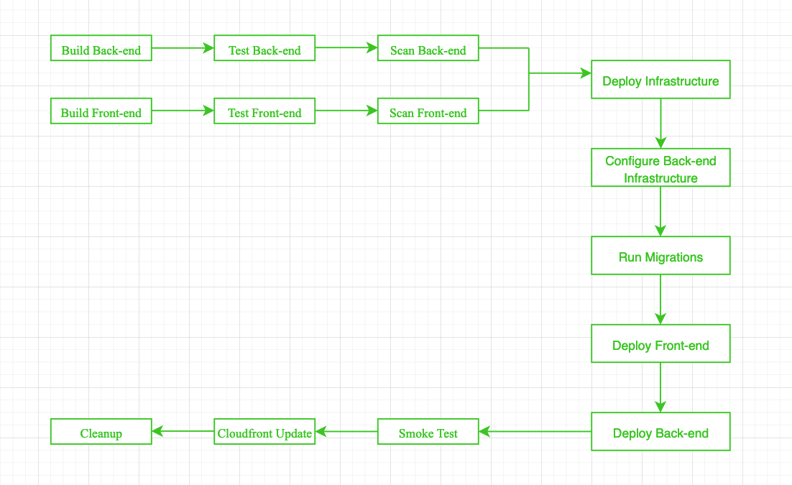

# Give your Application Auto-Deploy Superpowers

 

In this project, you will prove your mastery of the following learning objectives:

-   Explain the fundamentals and benefits of CI/CD to achieve, build, and deploy automation for cloud-based software products.
-   Utilize Deployment Strategies to design and build CI/CD pipelines that support Continuous Delivery processes.
-   Utilize a configuration management tool to accomplish deployment to cloud-based servers.
-   Surface critical server errors for diagnosis using centralized structured logging.

 

### Built With

-   [Circle CI](www.circleci.com) - Cloud-based CI/CD service
-   [Amazon AWS](https://aws.amazon.com/) - Cloud services
-   [AWS CLI](https://aws.amazon.com/cli/) - Command-line tool for AWS
-   [CloudFormation](https://aws.amazon.com/cloudformation/) - Infrastrcuture as code
-   [Ansible](https://www.ansible.com/) - Configuration management tool
-   [Prometheus](https://prometheus.io/) - Monitoring tool

 

figure: CI/CD Pipeline Diagram
 

 

 

 

## Monetoring with Prometheus

 

 

 

 

 

 

 

 

 

 

 

 
